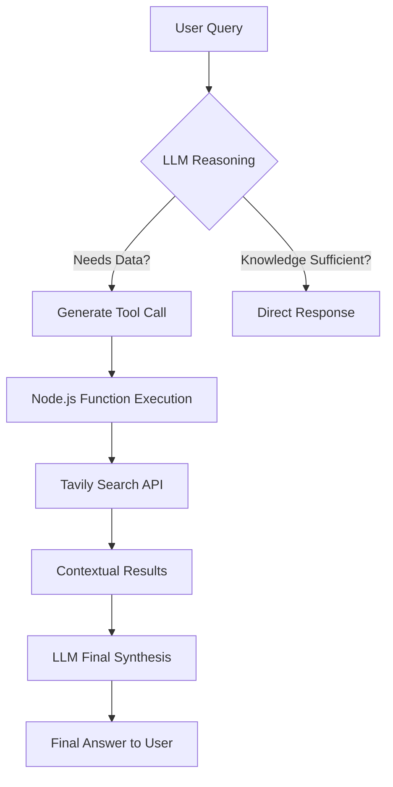

# 🧠 PavilionAI: Dynamic LLM Agent
> **Bridging the gap between LLMs and Real-Time Data through Intelligent Tool Calling.**

[](https://nodejs.org/)
[](https://groq.com/)
[](https://ai.meta.com/)

**PavilionAI** is a high-performance Agentic AI implementation that solves the "hallucination problem." By leveraging **LLaMA 3.3 70B** and the **Tavily Web Search API**, this assistant intelligently decides when to stop "thinking" and start "searching."

---

## 🚀 Key Capabilities

* **🎯 Zero-Shot Tool Selection:** Automatically detects if a query requires external data.
* **🌐 Real-Time Grounding:** Fetches live data to answer questions about current events (e.g., sports scores, news, or stock prices).
* **⚙️ Deterministic Execution:** Configured with `temperature: 0` for consistent, reliable logic.
* **🏗️ Schema-First Design:** Uses structured JSON Schema for robust function parameter passing.

---

## 🛠️ Tech Stack

| Component | Technology | Role |
| :--- | :--- | :--- |
| **Model** | LLaMA 3.3 70B | The "Brain" (Reasoning & Intent) |
| **Inference** | Groq SDK | Lightning-fast LLM execution |
| **Search Engine** | Tavily API | Real-time Web Search optimized for LLMs |
| **Runtime** | Node.js | System orchestration & Tool execution |

---

## 🏗️ Architecture: How It Works


# 📂 Project Structure
```js
AIToolCalling/
├── 📄 index.js          # Core Logic & Tool Orchestration
├── 📄 .env              # Sensitive Credentials
├── 📄 package.json      # Dependencies
└── 📄 README.md         # Documentation
```
# ⚙️ Quick Start
1️⃣ Clone & Install
```
git clone [https://github.com/DeveloperManojKumarMeena/AIToolCalling.git](https://github.com/DeveloperManojKumarMeena/AIToolCalling.git)
cd AIToolCalling
npm install
```
2️⃣ Configure Environment <br>
Create a .env file in the root directory:

```
GROK_API_KEY=your_groq_api_key_here
TAVILY_API_KEY=your_tavily_api_key_here
```
3️⃣ Launch
```
node index.js
```
# 🤝 Connectivity
Manoj Kumar Meena -<a href='https://github.com/DeveloperManojKumarMeena'> Github  </a> || 
<a href='https://www.linkedin.com/in/manojkumarmeenasir/'>Linkedin</a>